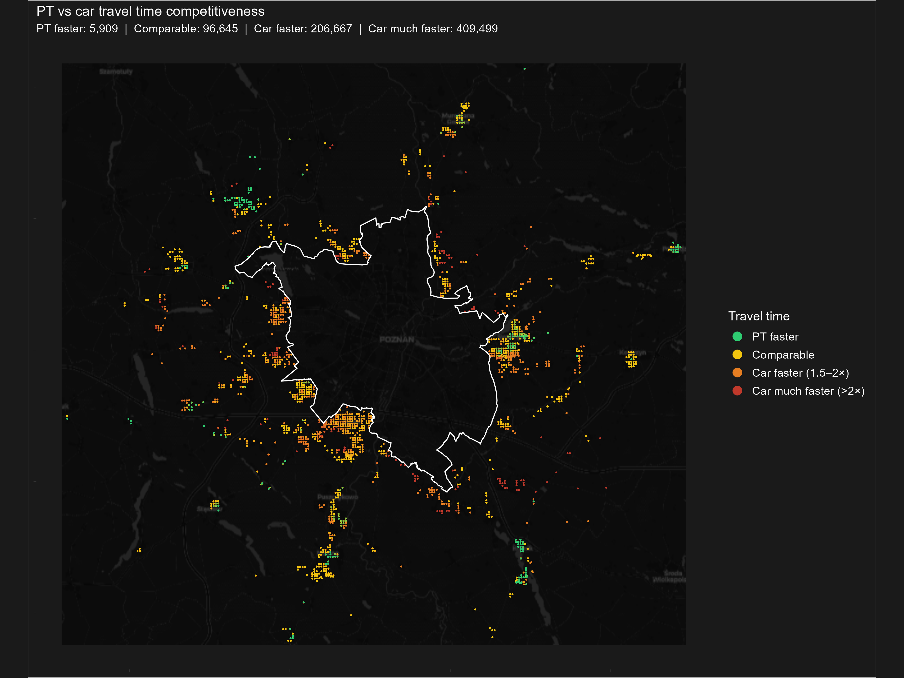

# Commuting Efficiency and PT Accessibility Deficits in the Poznań Metropolitan Area

## About this repository

This repository contains the data processing and analysis pipeline for a
study of public transport (PT) accessibility deficits in the Poznań
metropolitan area, Poland. The project compares PT and car travel times
across the region to identify where public transport is competitive with
private car travel, where it lags significantly, and which areas should
be prioritized for PT investment.

The core workflow combines:

- **Workplace surfaces** derived from BDOT10k topographic data and CEIDG
  business registry records, used to estimate the spatial distribution of
  employment.
- **Working-age population** distributed across a fine-grained spatial
  grid (200 m resolution).
- **Multimodal routing** via [r5r](https://github.com/ipeaGIT/r5r), run in
  batch across municipalities in the Poznań metropolitan area, to generate
  comparable PT and car itineraries for origin–destination pairs.
- **Travel time ratio analysis**, weighting itinerary-level PT/car
  comparisons by population and workplace counts to identify areas of PT
  competitiveness versus deficit.
- **Spatial classification and clustering** (LISA) to characterize the
  spatial structure of PT deficits and to support a multi-dimensional PT
  investment priority typology (implemented in `09_analyse_itineraries.R`
  and `10_OD_comparison.R`, sharing logic from `lisa_priority_utils.R`).
- **Regression modelling** of the PT/car travel time ratio against network,
  stop-accessibility, and population-exposure variables built per OD pair
  (`11_regression_analysis.R`).
- **Validation against census commuting flows**, comparing a population ×
  workplace gravity-style proxy for synthetic OD volume to the empirical
  LAU-to-LAU commuting matrix (`12_validate_od_flows.R`).
- **Spatial regression comparison** (OLS baseline, Lagrange Multiplier
  tests, SAR, SEM, Spatial Durbin Model, and GWR) on origin-zone PT/car
  travel-time ratios, motivated by the significant global Moran's I found
  on the modal gap surface — plain OLS residuals are not spatially
  independent (`13_gwr_sdm_comparison.R`).

The output of this pipeline supports a manuscript analyzing modal gaps and
PT accessibility deficits in the Poznań metropolitan area, intended for
transport geography and spatial information science audiences.

### Example result




Origin–destination pairs classified by PT/car travel time ratio (`10_OD_comparison.R`), one of several figures written to `Figures/`.

## Requirements

- **R** (version TBD — specify the version you developed against)
- Key packages:
  - `dplyr`, `tidyverse`, `ggplot2`, `patchwork`, `ggnewscale` — data
    wrangling and plotting
  - `sf`, `terra` — spatial/raster data handling
  - `osmdata` — OSM boundary/road/POI queries (live Overpass API calls)
  - `r5r` (+ `rJavaEnv`) — multimodal routing (requires Java 21; see the
    [r5r setup guide](https://ipeagit.github.io/r5r/) for installation
    details)
  - `spdep` — spatial clustering (LISA)
  - `tidytransit` — GTFS feed parsing
  - `maptiles`, `tidyterra` — basemap tiles for final figures (live tile
    server requests)
  - `data.table` — fast grouping in `06_add_weights_to_itineraries.R`
  - `scales` — axis/label formatting in `10_OD_comparison.R` and
    `12_validate_od_flows.R`
  - `corrplot`, `car` — correlation matrix and VIF diagnostics in
    `11_regression_analysis.R`
  - `sp`, `spatialreg`, `GWmodel` — Spatial Durbin Model and GWR in
    `13_gwr_sdm_comparison.R` (in addition to `spdep`, already listed above)

> **Note:** fill in exact package versions (e.g. via `renv::snapshot()` or
> a `sessionInfo()` dump) once the pipeline is stable, so results are
> reproducible. Steps that call the public Overpass API or basemap tile
> servers (`osmdata`, `maptiles`) are not reproducible offline and depend
> on those services' availability.

## Data availability

- **BDOT10k** — Polish national topographic database; access terms TBD
  (state whether raw data is included, downloadable from a public source,
  or restricted). Used as `Data/work_bdot.gpkg`.
- **CEIDG** — Polish business registry; access terms TBD. Used as
  `Data/ceidg_geocode.csv`.
- **Population data** — source and access terms TBD. Used as
  `Data/pop_geocoded.csv`.
- **GTFS feeds** — one or more `.zip` feeds for the region's PT operators,
  placed under `Data/gtfs/`.
- **r5r routing inputs** (OSM extract `.pbf` + GTFS feeds) — placed under
  `Data/routing/`, per the
  [r5r data requirements](https://ipeagit.github.io/r5r/articles/prepare_inputs_r5r.html).
- **Administrative boundaries** — `Data/ap.gpkg` (the ring of municipalities
  surrounding Poznań — verified to contain no Poznań polygon at all, not an
  "agglomeration" including the core), `Data/poz.gpkg` (the Poznań core city
  boundary alone — verified to contain exactly one municipality, Poznań, and
  none of the ring), and optionally `Data/boundary.gpkg` (Poznań city;
  fetched from OSM automatically by `01_calculate_workplaces.R` if not
  present, independent of `poz.gpkg`).
- **OD flow data** — `Data/OD_flows.csv`, joined to `ap.gpkg` by `JPT_ID`
  in `03_merge_pop_workplaces.R`, and used as the empirical validation
  target (joined by municipality name, `home_name`/`work_name`) in
  `12_validate_od_flows.R`.

> Specify whether raw input data is included in this repository, provided
> via a separate download link, or restricted due to licensing.

## Repository structure

```
scripts/
├── 01_calculate_workplaces.R
├── 02_distribute_population.R
├── 03_merge_pop_workplaces.R
├── 04_r5r_route_batch.R
├── 05_read_itineraries.R
├── 06_add_weights_to_itineraries.R
├── 07_explore_travel_ratios.R
├── 08_plot_itineraries.R
├── 09_analyse_itineraries.R
├── 10_OD_comparison.R
├── 11_regression_analysis.R
├── 12_validate_od_flows.R
├── 13_gwr_sdm_comparison.R
└── lisa_priority_utils.R   <- shared helpers sourced by 09, 10 and 11
Data/            <- input and intermediate data (see "Data availability")
Figures/         <- output PNGs written by ggsave() calls (e.g. Fig_PT_vs_car_travels.png)
```

Filenames are zero-padded (`01`–`12`) so a plain alphabetical listing (file
browsers, `ls`, GitHub's file view) sorts in actual execution order — a
one-digit `1_...` would otherwise sort after `10_...`/`11_...`/`12_...` as
plain text.

> Adjust the tree above to match your actual folder layout, and confirm
> the `Data/`/`Output/` paths scripts read from and write to.

## Running the pipeline

Each script's first line of substance is an absolute `setwd(...)` pointing
at the local data folder (currently
`C:/Users/wozni/Google Drive/UAM/HUB/MobilityPatterns/Data` — update this
path in every script if you clone onto a different machine), so all file
paths inside a script are relative to that folder. `lisa_priority_utils.R`
is sourced via its own absolute path (in the git repo's `scripts/`
folder), independent of the data location.

### Dependency graph

```
01 ─┐
    ├─→ 04 → 05 → 06 → 07
02 ─┘         │    └─→ (standalone exploration)
              ├─→ 08
              ├─→ 09  ─┐
              ├─→ 10   │  (09, 10, 11 all source lisa_priority_utils.R;
              ├─→ 11 → 13 │   10 and 11 also read pop_grid.gpkg from step 02)
              └─→ 12   │
03 (diagnostic, reads outputs of 01 & 02, not required by 04)

12 also reads workplace_grid.gpkg (step 01), ap.gpkg and poz.gpkg (ring and
core respectively -- used together for municipality classification), and
the external OD_flows.csv census matrix (restricted to neighborhood -> core
flows).

13 reads only regression_data.csv (step 11's output) -- no other inputs --
so it can be re-run on its own once 11 has produced that file.
```

Note that **03 is not on the critical path to 04** — routing in step 04
reads `pop_grid.gpkg`/`workplace_grid.gpkg` directly from steps 01–02.
Step 03 produces a diagnostic combined grid (`pop_workplaces_grid.gpkg`,
`pop_wp_flows_grid.gpkg`) and introductory figures; run it whenever you
want those, but it does not block later steps.

**05 → {06, 08, 09, 10, 11, 12} is now file-based, not session-based.**
Step 05 rasterizes and consolidates the raw per-municipality itinerary
files and writes `itineraries_results.rds`, `pt_itineraries.rds`, and
`car_itineraries.rds` to `Data/`. Steps 06, 08, 09, 10, 11, and 12 each
`readRDS()` those files at the top, so they can be run independently in
fresh R sessions, in any order relative to each other, as long as step 05
has run at least once.

1. **`01_calculate_workplaces.R`** — Derives a 200 m workplace grid from
   BDOT10k building floor area (`work_bdot.gpkg`) and CEIDG small-business
   counts (`ceidg_geocode.csv`), weighted and scaled to the city's total
   workplace count.
   *Output: `workplace_grid.gpkg`*
2. **`02_distribute_population.R`** — Distributes working-age population
   across a 200 m grid, clipped to municipality boundaries.
   *Output: `pop_grid.gpkg`*
3. **`03_merge_pop_workplaces.R`** — Spatially joins the population and
   workplace grids into one combined dataset and produces introductory
   figures (population/workplace density, OD commuter flows). Diagnostic
   step, not required by routing.
   *Output: `pop_workplaces_grid.gpkg`, `pop_wp_flows_grid.gpkg`, `OD_sf.gpkg`*
4. **`04_r5r_route_batch.R`** — Runs batch multimodal routing (r5r) across
   municipalities, generating PT and car itineraries for each OD pair
   above population/workplace cutoffs.
   *Output: `itineraries/{pt,car}_itineraries_<municipality>.gpkg`*
5. **`05_read_itineraries.R`** — Reads and consolidates the raw routing
   output into combined itineraries datasets, and rasterizes per-county
   flow density at 120 m for later mapping.
   *Output: `itineraries_results.rds`, `pt_itineraries.rds`, `car_itineraries.rds`*
6. **`06_add_weights_to_itineraries.R`** — Attaches population/workplace
   weights to each itinerary for later aggregation.
   *Output: `itineraries_weights.csv`*
7. **`07_explore_travel_ratios.R`** — Exploratory analysis of PT/car travel
   time ratios: population-weighted distributions, rail vs. non-rail
   comparison, competitive vs. improvement-needed itineraries.
8. **`08_plot_itineraries.R`** — Generates map-based visualizations of
   itinerary flow density for PT vs. car, plus route-level descriptive
   statistics per OD pair (duration, distance, transfers, PT/car
   competitiveness breakdown) computed directly from `pt_itineraries.rds`/
   `car_itineraries.rds`, since those attributes aren't present in the
   rasterized flow surfaces used for the map.
   *Output: `Figures/Fig_cars_pt_itineraries.png`,
   `Figures/Fig_duration_boxplot_pt_car.png`,
   `Figures/Fig_distance_boxplot_pt_car.png`,
   `itinerary_summary_stats.csv`,
   `itinerary_competitiveness_breakdown.csv`*
9. **`09_analyse_itineraries.R`** — LISA clustering of car-vs-PT flow
   density (mapped as the full four-quadrant HH/LL/HL/LH classification,
   not just the High-High subset), PT-accessibility classification against
   GTFS stop frequency, and the multi-dimensional PT investment priority
   typology.
   *Output: `Figures/Fig_LISA_cluster_map.png`,
   `Figures/Fig_PT_investment_priority.png`*
10. **`10_OD_comparison.R`** — OD travel-time comparison (PT vs. car)
    across counties near Poznań, rebuilding its own LISA/car-zone
    classification from scratch (reusing the shared helpers in
    `lisa_priority_utils.R`, also used by step 09) rather than reusing
    step 09's already-computed result.
    *Output: `Figures/Fig_PT_vs_car_travels.png`,
    `Figures/Fig_PT_vs_car_travels_HEX.png`,
    `Figures/Fig_PT_vs_car_travels_by_origin.png`*
11. **`11_regression_analysis.R`** — Builds a per-OD-pair regression
    dataset (PT/car efficiency, route directness, GTFS stop distance and
    frequency, rail access, origin/destination population exposure) and
    runs correlation, VIF, and OLS diagnostics on the PT/car travel time
    ratio. Uses `stops_poznan` (with `is_rail`/`service_days`) from
    `load_gtfs_stops()` in `lisa_priority_utils.R`, and
    `pop_grid.gpkg` from step 02, for the stop- and population-based
    variables. `vif_model`/`lm_base` exclude `pt_duration_min` (the
    outcome's own numerator) and use `car_directness` in place of
    `car_speed_kmh` (derived from `car_duration_min`, the outcome's
    denominator) — both share mechanical components with `tt_ratio` and
    would otherwise be close to circular as predictors.
    *Output: `regression_data.csv`*
12. **`12_validate_od_flows.R`** — Validates synthetic routing output
    against the empirical census LAU-to-LAU commuting matrix
    (`OD_flows.csv`), restricted to **neighborhood → core** commuting:
    flows from the municipalities surrounding Poznań into the Poznań core
    itself. `ap.gpkg` and `poz.gpkg` are used together for municipality
    classification: `ap.gpkg` contains the ring of surrounding
    municipalities and no Poznań polygon, while `poz.gpkg` contains
    exactly the Poznań core and none of the ring (verified directly
    against both files — the opposite of what their names and earlier
    in-code comments suggested). The core municipality is taken directly
    from `poz.gpkg`, and "neighborhood" is every municipality in
    `ap.gpkg`. Aggregates surviving grid-cell
    OD pairs (union of car- and PT-reachable pairs) into a
    population(origin) × workplaces(destination) gravity-style proxy for
    synthetic flow volume per neighborhood municipality, matches against
    census commuters by municipality name, and reports a Spearman rank
    correlation plus a ranked bar chart comparing each municipality's
    *share* of the total neighborhood→core flow (synthetic proxy and
    census aren't on the same scale, so only relative share/rank is
    directly comparable, not absolute magnitude).
    *Output: `od_validation_neighborhood_to_core.csv`,
    `Figures/Fig_od_validation_scatter.png`,
    `Figures/Fig_od_validation_share_by_municipality.png`*
13. **`13_gwr_sdm_comparison.R`** — Formally tests which spatial
    specification best fits the origin-zone PT/car travel-time ratio,
    following standard spatial-econometrics practice: fits OLS, runs
    Lagrange Multiplier tests (`spdep::lm.LMtests()`, LMerr/LMlag +
    robust versions) to diagnose whether the data supports a spatial lag
    process, an error process, or both, then fits the three nested
    models this points to — SAR (lag only), SEM (error only), and SDM
    (Durbin: lag + spatially-lagged predictors) — and likelihood-ratio
    tests SDM against SAR and SEM (`spatialreg::LR.sarlm()`) to confirm
    the extra Durbin complexity is actually justified rather than
    assumed. Also fits GWR (`GWmodel::gwr.basic()`), but positions it as
    a secondary/exploratory tool answering a different question —
    spatial *non-stationarity* (do relationships vary by place) rather
    than spatial *dependence* (are values correlated with neighbors); a
    prior run showed GWR's much higher local R² doesn't reduce residual
    Moran's I anywhere near as much as SDM does, since GWR has no
    lag/error term. GWR's local coefficient maps remain useful for RQ3
    (which zones need which intervention type), just not as a competing
    answer to "which spatial model is correct."
    Aggregates `regression_data.csv` from OD-pair level to one row per
    origin grid cell (mean `tt_ratio` across that origin's destinations)
    since these models need one observation per location; builds a
    k-nearest-neighbour (k=8) spatial weights matrix (not the 120m
    distance-band weights used for LISA, since origin zones aren't on a
    regular raster after aggregation). Reports AIC, pseudo-R², and
    residual Moran's I for all five models side by side, plus the SDM's
    direct/indirect/total effect decomposition (spillovers — does
    improving PT at one origin measurably help its neighbors). Uses the
    same reduced predictor set as step 11's `lm_base` (excludes
    `pt_duration_min`, uses `car_directness`).
    *Output: `gwr_sdm_comparison.csv`, `spatial_dependence_tests.csv`,
    `sdm_impacts.csv`, `gwr_local_coefficients.csv`,
    `Figures/Fig_GWR_local_R2.png`,
    `Figures/Fig_GWR_coef_dist_to_stop.png`*

Steps 07–13 are exploratory/analytical and can be run independently once
step 06 (for 07), step 05 (for 08, 09, 10, 11, 12), or step 11 (for 13)
has produced its output.

## Citation

If you use this repository or its outputs, please cite:

> [Manuscript citation — TBD, forthcoming]

## License

[TBD — specify a license, e.g. MIT for code, and note any restrictions on
redistributing input data]

## Contact

[Maintainer name / email / affiliation — TBD]
