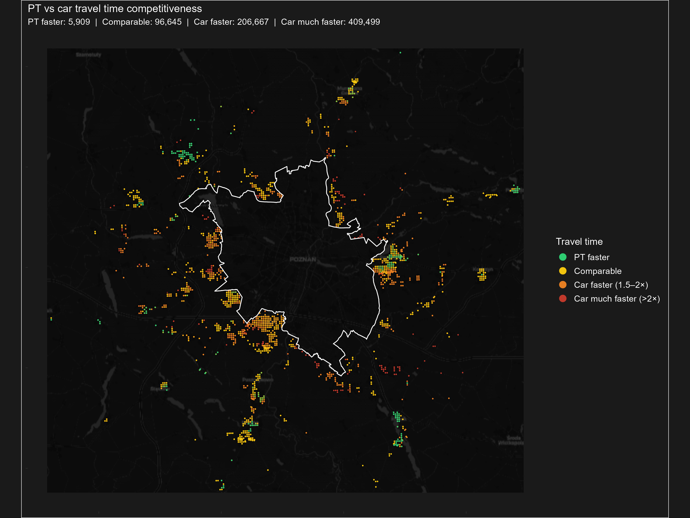

# Beyond Accessibility: Diagnosing Car–Public Transport Route Competitiveness Using Synthetic Trajectories

## About this repository

This repository contains the data processing and analysis pipeline for a
study of public transport (PT) accessibility deficits in the Poznań
metropolitan area, Poland. The project compares PT and car travel times
across the region to identify where public transport is competitive with
private car travel, where it lags significantly, and which areas should
be prioritized for PT investment.

The core workflow combines:

- **Workplace surfaces** derived from BDOT10k topographic data and CEIDG
  business registry records, used to estimate the spatial distribution of
  employment.
- **Working-age population** distributed across a fine-grained spatial
  grid (200 m resolution).
- **Multimodal routing** via [r5r](https://github.com/ipeaGIT/r5r), run in
  batch across municipalities in the Poznań metropolitan area, to generate
  comparable PT and car itineraries for origin–destination pairs.
- **Travel time ratio analysis**, weighting itinerary-level PT/car
  comparisons by population and workplace counts to identify areas of PT
  competitiveness versus deficit.
- **Spatial classification and clustering** (LISA) to characterize the
  spatial structure of PT deficits and to support a multi-dimensional PT
  investment priority typology (implemented in `08_analyse_itineraries.R`,
  using shared logic from `lisa_priority_utils.R`).
- **Regression modelling** of the PT/car travel time ratio against network,
  stop-accessibility, and population-exposure variables built per OD pair
  (`10_regression_analysis.R`).
- **Validation against census commuting flows**, comparing a population ×
  workplace gravity-style proxy for synthetic OD volume to the empirical
  LAU-to-LAU commuting matrix (`11_validate_od_flows.R`).
- **Spatial regression comparison** (OLS baseline, Lagrange Multiplier
  tests, SEM, and Spatial Durbin Model) on origin-zone PT/car
  travel-time ratios, motivated by the significant global Moran's I found
  on the route density gap surface — plain OLS residuals are not spatially
  independent (`12_spatial_regression_comparison.R`).
- **Geographically weighted regression (GWR)** on the same origin-zone
  model, testing whether predictors' associations with the travel-time
  ratio are spatially uniform or vary by location — a complement to the
  spatial-dependence models above, which hold every coefficient fixed
  across the study area (`13_gwr_analysis.R`).

The output of this pipeline supports a manuscript analyzing car--PT route density gaps and
PT accessibility deficits in the Poznań metropolitan area, intended for
transport geography and spatial information science audiences.

### Example result




Origin–destination pairs classified by PT/car travel time ratio (`09_OD_comparison.R`), one of several figures written to `Figures/`.

## Requirements

- **R** (developed and tested with R 4.4.1)
- Key packages:
  - `dplyr`, `tidyverse`, `ggplot2`, `patchwork`, `ggnewscale` — data
    wrangling and plotting
  - `ggpubr` — combined-panel plotting in `02_distribute_population.R`
  - `tmap` — thematic mapping in `01_calculate_workplaces.R`
  - `sf`, `terra` — spatial/raster data handling
  - `osmdata` — OSM boundary/road/POI queries (live Overpass API calls)
  - `r5r` (+ `rJavaEnv`) — multimodal routing (requires Java 21; see the
    [r5r setup guide](https://ipeagit.github.io/r5r/) for installation
    details)
  - `spdep` — spatial clustering (LISA)
  - `tidytransit` — GTFS feed parsing
  - `maptiles`, `tidyterra` — basemap tiles for final figures (live tile
    server requests)
  - `data.table` — fast grouping in `06_travel_ratio_analysis.R`
  - `scales` — axis/label formatting in `09_OD_comparison.R` and
    `11_validate_od_flows.R`
  - `corrplot`, `car` — correlation matrix and VIF diagnostics in
    `10_regression_analysis.R`
  - `spatialreg` — SEM/Spatial Durbin Model in
    `12_spatial_regression_comparison.R` (in addition to `spdep`, already listed above)
  - `GWmodel` — geographically weighted regression in `13_gwr_analysis.R`
    (and, optionally, `gwr_robustness_check.R`)

> **Note:** fill in exact package versions (e.g. via `renv::snapshot()` or
> a `sessionInfo()` dump) once the pipeline is stable, so results are
> reproducible. Steps that call the public Overpass API or basemap tile
> servers (`osmdata`, `maptiles`) are not reproducible offline and depend
> on those services' availability.

> **2026-08-28: CARTO's free basemap tiles now require an API key.**
> `get_tiles(provider = "CartoDB.DarkMatter", ...)` (used by Figs 3/5/8 —
> `07_plot_itineraries.R`, `09_OD_comparison.R`, `13_gwr_analysis.R`) now
> returns a watermarked "API KEY REQUIRED" tile for anonymous requests —
> confirmed this is CARTO-side (identical `maptiles` call, `OpenStreetMap`
> tiles fetch fine with no key). Not yet an issue for the already-saved
> figure PNGs, but **regenerating any of those three scripts' maps will
> come out watermarked** until either a free key
> (carto.com/basemaps/apikey) is obtained and passed via
> `get_tiles(apikey = ...)`, or they're switched to the inverted-Esri-
> grey-canvas-plus-Overpass-roads recipe `08_analyse_itineraries.R` and
> `06_travel_ratio_analysis.R`'s Part 3 already use instead (no key
> required — see note below). Separately, the Overpass roads half of that
> recipe is itself flaky on the public API (intermittent 502/504s,
> unrelated to the CARTO issue) — both scripts already retry once against
> a mirror and fall back to no roads layer rather than failing.

## Data availability

- **BDOT10k** — Polish national topographic database; access terms TBD
  (state whether raw data is included, downloadable from a public source,
  or restricted). Used as `Data/work_bdot.gpkg`.
- **CEIDG** — Polish business registry; access terms TBD. Used as
  `Data/ceidg_geocode.csv`.
- **Population data** — source and access terms TBD. Used as
  `Data/pop_geocoded.csv`.
- **GTFS feeds** — one or more `.zip` feeds for the region's PT operators,
  placed under `Data/gtfs/`.
- **r5r routing inputs** (OSM extract `.pbf` + GTFS feeds) — placed under
  `Data/routing/`, per the
  [r5r data requirements](https://ipeagit.github.io/r5r/articles/prepare_inputs_r5r.html).
- **Administrative boundaries** — `Data/ap.gpkg` (the ring of municipalities
  surrounding Poznań — verified to contain no Poznań polygon at all, not an
  "agglomeration" including the core), `Data/poz.gpkg` (the Poznań core city
  boundary alone — verified to contain exactly one municipality, Poznań, and
  none of the ring), and optionally `Data/boundary.gpkg` (Poznań city;
  fetched from OSM automatically by `01_calculate_workplaces.R` if not
  present, independent of `poz.gpkg`).
- **OD flow data** — `Data/OD_flows.csv`, joined to `ap.gpkg` by `JPT_ID`
  in `03_merge_pop_workplaces.R`, and used as the empirical validation
  target (joined by municipality name, `home_name`/`work_name`) in
  `11_validate_od_flows.R`.

> Specify whether raw input data is included in this repository, provided
> via a separate download link, or restricted due to licensing.

## Repository structure

```
run_pipeline.ps1   <- thin wrapper around scripts/00_run_pipeline.R, run from repo root
scripts/
├── 00_run_pipeline.R
├── 01_calculate_workplaces.R
├── 02_distribute_population.R
├── 03_merge_pop_workplaces.R
├── 04_r5r_route_batch.R
├── 05_read_itineraries.R
├── 06_travel_ratio_analysis.R
├── 07_plot_itineraries.R
├── 08_analyse_itineraries.R
├── 09_OD_comparison.R
├── 10_regression_analysis.R
├── 11_validate_od_flows.R
├── 12_spatial_regression_comparison.R
├── 13_gwr_analysis.R
├── gwr_robustness_check.R  <- optional, ~9hr, NOT run by 00_run_pipeline.R -- see its own header
├── lisa_priority_utils.R   <- shared LISA/priority-typology helpers, sourced by 08 and 10
└── od_pair_utils.R         <- shared OD-pair-comparison helper, sourced by 06, 07, 09 and 10
Data/            <- input and intermediate data (see "Data availability")
Figures/         <- output PNGs written by ggsave() calls (e.g. Fig_PT_vs_car_travels.png)
```

Filenames are zero-padded (`01`–`13`) so a plain alphabetical listing (file
browsers, `ls`, GitHub's file view) sorts in actual execution order — a
one-digit `1_...` would otherwise sort after `10_...`/`11_...`/`12_...`/`13_...` as
plain text. `gwr_robustness_check.R` deliberately has no number prefix — it's
not a pipeline step, see "Repository structure" above.

> **2026-07-27: former scripts 06 and 07 were merged** into
> `06_travel_ratio_analysis.R` — `itineraries_weights.csv` (old 06's only
> output) had exactly one consumer, old 07, so splitting weight-attachment
> from the analysis that immediately read it back in was pure indirection.
> Everything from old 08 onward shifted down by one number accordingly
> (old 08→07, 09→08, 10→09, 11→10, 12→11, 13→12). If you have local
> notes, scripts, or a `renv`/CI config referencing the old numbering,
> they'll need updating too.

> **2026-08-20: `11b_town_rural_validation_chart.R` and
> `11c_validation_ratio_map.R` removed.** Both were exploratory figures
> (town/rural under-prediction slope chart; a municipality-level ratio
> choropleth) never referenced in the manuscript — the user explicitly
> declined including the town/rural chart (it reads as highlighting a
> census-vs-synthetic discrepancy more starkly than the manuscript's prose
> does) and the ratio map was left as an unintegrated draft. Their output
> PNGs (`Fig_od_validation_town_rural.png`, `Fig_od_validation_ratio_map.png`)
> were also deleted as orphaned outputs. **`13_gwr_analysis.R` added** the
> same day — geographically weighted regression on the same origin-level
> model as step 12, reporting one manuscript-reported finding (departure
> frequency's spatially-varying local coefficient). See its own header
> comment for the full methodological rationale (why classic GWR and not
> multiscale, why only one predictor gets mapped) and
> `gwr_robustness_check.R` (not part of the numbered pipeline, ~9hr runtime)
> for the validation methodology behind that choice.

> **2026-08-28: `06_travel_ratio_analysis.R` gained a Part 3** — a
> restyled reconstruction of a Google-Drive-only exploratory script
> (`explore_travel_ratios.R`, predates the 2026-07-27 merge that created
> this file) mapping the 30 top ZTM bus/tram routes carrying the most-,
> moderately-, and least-competitive PT itineraries (same weighting and
> `< 1.5` / `1.5–2.5` / `>= 2.5` time-ratio bands as the existing
> `competitive`/`improvement` municipality tables just above it). New
> inputs for this script: `ap.gpkg`, `gtfs/ztm.zip`,
> `itineraries_weights_route_detail.csv` (see below). New output:
> `Figures/Fig_travelratio_route_competitiveness.png`.
>
> **Data source (final, 2026-08-31)**: the original script's `route`/`mode`
> single-string-per-itinerary columns don't exist in the current pipeline's
> own `itineraries_weights.csv`. A first attempt reconstructed them from
> `pt_itineraries.rds`'s segment-level data — ran fine, but produced a
> visibly different route selection than the user's reference screenshot
> (a wrong-source-data bug, not a styling one), since it was necessarily
> built from a different, more recent itinerary run. The actual original
> `itineraries_weights.csv` (688,297 rows, one row per itinerary,
> `route`/`mode` comma-joined per segment) was recovered from
> `~/Downloads/` and copied in as `itineraries_weights_route_detail.csv`,
> used only by this Part 3. **Validated** by re-running the original
> script's own logic verbatim (`tmap`, `ap.gpkg`, no crop) against the
> recovered file — closely reproduced the reference screenshot in all
> three bands, confirming the fix. **A second, separate bug then surfaced**:
> even with the correct data, the dark-restyled figure's routes still
> didn't match the replication, because `slice_max(n=30)` was being taken
> on the raw exploded route-token table *before* joining to real GTFS
> shapes / filtering to the ROI, not after — the original script's order
> is join → ROI-filter → drop non-matches → *then* rank. Placeholder
> tokens ("0" for WALK legs, present in nearly every itinerary; "KW"/"IC"
> for rail, no shape in `ztm.zip`) have huge cumulative weight purely from
> ubiquity, so ranking first let them occupy top-30 slots a real route
> should have had. Fixed by reordering to match the original exactly.
>
> **Styling (final, 2026-08-31)**: dark basemap (inverted Esri grey canvas
> + Overpass roads, no CARTO key needed — see note above), full uncropped
> `ap.gpkg` extent (an earlier session tightened/cropped this, but that
> crop was tuned against the wrong route data above — the correct routes
> fill the full extent well on their own). Only the core-city `poz.gpkg`
> outline is drawn, matching every other figure in the manuscript — all 25
> individual `ap.gpkg` municipal boundaries (matching the original
> script's `roi` layer exactly) were tried too, but removed per a
> follow-up request as too cluttered against the routes; `ap.gpkg` is
> still used for the ROI filter/map extent, just not drawn. Panel titles
> 18pt bold, wrapped onto two lines (robust to
> patchwork column-width shifts); canvas 24in × 7in. A
> `plot_annotation(theme=)` composite-level background is needed
> separately from each panel's own `plot.background` (patchwork's own
> gutters render white by default otherwise).

> Adjust the tree above to match your actual folder layout, and confirm
> the `Data/`/`Output/` paths scripts read from and write to.

## Running the pipeline

**One-command run: `scripts/00_run_pipeline.R`** (or `run_pipeline.ps1` at the
repo root, a thin wrapper around it) runs every step in order in one go, each
in its own fresh `Rscript` process. It skips the expensive, one-time phase A
(steps 01-05: grids + r5r routing + itinerary consolidation) automatically if
`itineraries_results.rds`/`pt_itineraries.rds`/`car_itineraries.rds` already
exist in `Data/`, and always runs phase B (steps 06-13, the actual analysis
outputs) fresh. Pass `--force` (`-Force` for the `.ps1`) to redo phase A from
scratch too -- step 04 alone can take hours, so only do this deliberately.
Prints a PASS/FAIL/SKIPPED summary with per-step timings at the end. See the
header comment in `00_run_pipeline.R` for full detail; the manual,
one-script-at-a-time workflow described below still works exactly as before.

Each script's first line of substance is an absolute `setwd(...)` pointing
at the local data folder (currently
`C:/Users/wozni/Google Drive/UAM/HUB/MobilityPatterns/Data` — update this
path in every script if you clone onto a different machine), so all file
paths inside a script are relative to that folder. `lisa_priority_utils.R`
and `od_pair_utils.R` are each sourced via their own absolute path (in the
git repo's `scripts/` folder), independent of the data location. Both are
shared-helper files only — running either directly does nothing (no
executable top level), and every script that needs them documents that in
a `REQUIRES TO RUN:` header comment, alongside every upstream `.rds`/
`.gpkg` file it expects to already exist.

### Dependency graph

```
01 ─┐
    ├─→ 04 → 05 ─┬─→ 06
02 ─┘             ├─→ 07
                   ├─→ 08
                   ├─→ 09
                   ├─→ 10 ─┬─→ 12
                   │        └─→ 13
                   └─→ 11
03 (diagnostic, reads outputs of 01 & 02, not required by 04)

06, 07, 09, 10 all source od_pair_utils.R (collapses raw itineraries to
one row per OD pair with a PT/car travel-time ratio -- previously each
re-implemented this independently; unified 2026-07-27).
06's Part 3 (route-competitiveness map) additionally reads ap.gpkg,
gtfs/ztm.zip, and itineraries_weights_route_detail.csv (a recovered
snapshot of an earlier itinerary run -- not regenerated by any pipeline
step, see the note above).
08 and 10 source lisa_priority_utils.R (LISA clustering + PT investment
priority typology). 09 and 10 also read pop_grid.gpkg from step 02.

11 also reads workplace_grid.gpkg (step 01), ap.gpkg and poz.gpkg (ring and
core respectively -- used together for municipality classification), and
the external OD_flows.csv census matrix (restricted to neighborhood -> core
flows).

12 reads only regression_data.csv (step 10's output) -- no other inputs --
so it can be re-run on its own once 10 has produced that file.

13 also reads only regression_data.csv (same as 12, independently -- it
does not depend on 12's output) plus poz.gpkg for the map's city-boundary
outline. gwr_robustness_check.R (no number prefix, not run by
00_run_pipeline.R) has the same inputs; see its header comment for why it's
kept separate.
```

Note that **03 is not on the critical path to 04** — routing in step 04
reads `pop_grid.gpkg`/`workplace_grid.gpkg` directly from steps 01–02.
Step 03 produces a diagnostic combined grid (`pop_workplaces_grid.gpkg`,
`pop_wp_flows_grid.gpkg`) and introductory figures; run it whenever you
want those, but it does not block later steps.

**05 → {06, 07, 08, 09, 10, 11} is now file-based, not session-based.**
Step 05 rasterizes and consolidates the raw per-municipality itinerary
files and writes `itineraries_results.rds`, `pt_itineraries.rds`, and
`car_itineraries.rds` to `Data/`. Steps 06, 07, 08, 09, 10, and 11 each
`readRDS()` those files at the top, so they can be run independently in
fresh R sessions, in any order relative to each other, as long as step 05
has run at least once.

1. **`01_calculate_workplaces.R`** — Builds a 200 m workplace grid from
   BDOT10k floor area and CEIDG business counts.
   *Output: `workplace_grid.gpkg`*
2. **`02_distribute_population.R`** — Distributes working-age population
   across a 200 m grid, clipped to municipality boundaries.
   *Output: `pop_grid.gpkg`*
3. **`03_merge_pop_workplaces.R`** — Joins the population and workplace
   grids and produces introductory figures. Diagnostic only, not required
   by routing.
   *Output: `pop_workplaces_grid.gpkg`, `pop_wp_flows_grid.gpkg`, `OD_sf.gpkg`*
4. **`04_r5r_route_batch.R`** — Runs batch multimodal routing (r5r) to
   generate PT and car itineraries for each OD pair above the
   population/workplace cutoffs.
   *Output: `{pt,car}_itineraries_<municipality>.gpkg` (intermediate,
   consolidated by step 05)*
5. **`05_read_itineraries.R`** — Consolidates raw routing output and
   rasterizes flow density at 120 m.
   *Output: `itineraries_results.rds`, `pt_itineraries.rds`, `car_itineraries.rds`*
6. **`06_travel_ratio_analysis.R`** — Collapses itineraries to one row per
   OD pair, attaches population/workplace weights, and explores PT/car
   travel-time ratios (rail vs. non-rail, competitive vs.
   improvement-needed), plus a map of the top 30 ZTM routes carrying the
   most/moderately/least competitive itineraries.
   *Output: `itineraries_weights.csv`, several `Figures/Fig_travelratio_*.png`
   (including `Fig_travelratio_route_competitiveness.png`),
   `competitive_by_municipality.csv`, `improvement_by_municipality.csv`*
7. **`07_plot_itineraries.R`** — Maps itinerary flow density for PT vs.
   car and reports route-level descriptive statistics (duration,
   distance, transfers, competitiveness).
   *Output: `Figures/Fig_cars_pt_itineraries.png`,
   `Figures/Fig_duration_boxplot_pt_car.png`,
   `Figures/Fig_distance_boxplot_pt_car.png`,
   `itinerary_summary_stats.csv`, `itinerary_competitiveness_breakdown.csv`*
8. **`08_analyse_itineraries.R`** — LISA clustering of car-vs-PT flow
   density, PT-accessibility/frequency classification, and the PT
   investment priority typology, plus a rail-access cross-tab and a
   population-weighted robustness check on the clustering.
   *Output: `Figures/Fig_LISA_cluster_map.png`,
   `Figures/Fig_PT_investment_priority.png`,
   `rail_access_by_priority.csv`, `lisa_weighted_robustness_crosstab.csv`*
9. **`09_OD_comparison.R`** — Maps the per-OD-pair PT/car travel-time
   ratio (point map, hex-binned, origin-level mean).
   *Output: `Figures/Fig_PT_vs_car_travels.png`,
   `Figures/Fig_PT_vs_car_travels_HEX.png`,
   `Figures/Fig_PT_vs_car_travels_by_origin.png`*
10. **`10_regression_analysis.R`** — Builds the per-OD-pair regression
    dataset and runs VIF/correlation diagnostics to select the final
    predictor set (fit properly in step 12).
    *Output: `regression_data.csv`*
11. **`11_validate_od_flows.R`** — Validates synthetic routing output
    against the census commuting matrix for neighbourhood → core flows,
    via a population × workplace gravity-style proxy with a
    grid-searched distance-decay exponent.
    *Output: `od_validation_neighborhood_to_core.csv`,
    `od_validation_beta_sensitivity.csv`,
    `Figures/Fig_od_validation_scatter.png`,
    `Figures/Fig_od_validation_share_by_municipality.png`*
12. **`12_spatial_regression_comparison.R`** — Fits OLS/SEM/SDM on the
    origin-level PT/car ratio, runs LM/LR tests to justify the spatial
    specification, and reports the SDM effect decomposition.
    *Output: `spatial_regression_comparison.csv`, `spatial_dependence_tests.csv`,
    `sdm_impacts.csv`, `regression_vif.csv`*
13. **`13_gwr_analysis.R`** — Fits geographically weighted regression
    (adaptive bisquare kernel, AIC-selected bandwidth) on the same
    origin-level model as step 12, testing whether predictors' effects
    vary spatially rather than holding globally. Saves local coefficients
    for all nine predictors, but only maps departure frequency — the one
    predictor that is both significant in the SDM (step 12) and
    directly actionable by planners, and whose local coefficients passed
    a robustness check against an independent estimator (see
    `gwr_robustness_check.R`, not part of the normal pipeline).
    *Output: `gwr_local_coefficients.csv`,
    `Figures/Fig_GWR_departures_local.png`*

Steps 06–13 are exploratory/analytical and can be run independently once
step 05 has produced its output (for 06, 07, 08, 09, 10, 11), or step 10
(for 12, 13) has produced `regression_data.csv`.

## Citation

If you use this repository or its outputs, please cite:

> Wozniak, M., Radzimski, A. Beyond Accessibility: Diagnosing Car–Public
> Transport Competitiveness and Spatial Disparities Using Synthetic
> Trajectories. Manuscript submitted to *Computers, Environment and Urban
> Systems*.
>
> [Update with full citation — volume/pages/DOI — once accepted/published.]

## License

[TBD — specify a license, e.g. MIT for code, and note any restrictions on
redistributing input data]

## Contact

Marcin Wozniak (corresponding author), woz@amu.edu.pl — Faculty of Human
Geography and Planning, Adam Mickiewicz University, Poznań, Poland.
